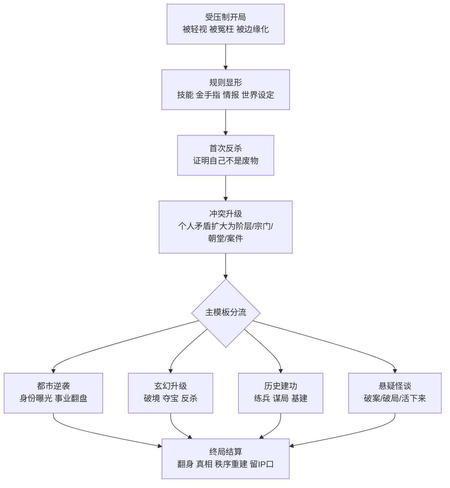
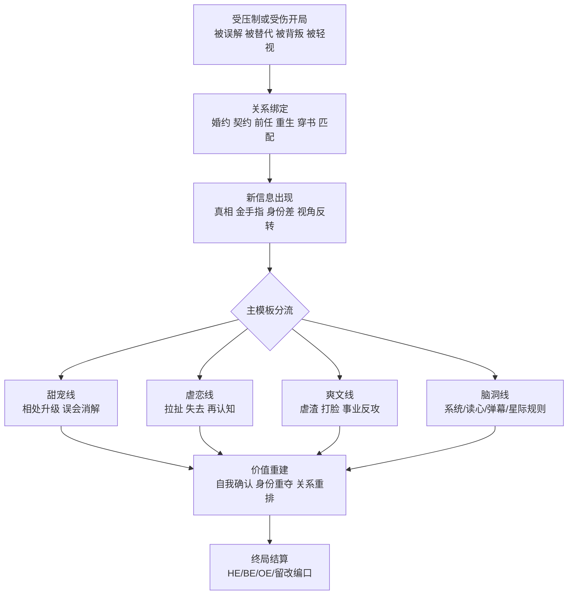
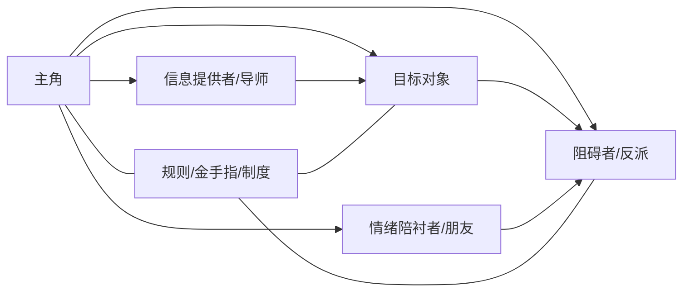

# 中文短篇小说平台男频女频题材与叙事要素研究报告

## 执行摘要

这份报告不把“全网短篇小说题材”理解为一个可以一次性穷尽、永久封闭的清单，而是把它视为一个持续扩展的“类型—设定—剧情—角色—平台分发”系统。基于番茄、七猫、知乎旗下的 entity["organization","盐言故事","short story app"]、晋江四类核心平台的公开规则、分类页、榜单页、征文页、作品标签、公开评论与行业/学术报告，我将中文短篇小说拆成六个可操作层：题材主类、子题材、背景设定、冲突引擎、人物原型、平台适配。这样做的原因很直接：各平台对“短篇”的口径并不一致。番茄的短故事官方口径强调 3 万字内、强钩子、强反转与高情绪密度；知乎短篇投稿口径可到 8k—10w；晋江以“中短篇频道”和“短篇包月”组织内容；七猫近年则补齐了短故事功能、短篇征文和短剧改编通道。换句话说，真正稳定的不是“字数线”，而是“单次阅读可完成、信息密度高、冲突和情绪结算快”的叙事结构。citeturn36view0turn5view0turn10search0turn10search3turn32view0turn27view1

在男频短篇中，最稳定的六条主干是：都市逆袭、玄幻升级、历史/架空建功、悬疑/民俗怪谈、系统/游戏/脑洞、现实世情/职业叙事。它们共享的发动机不是“谈关系”，而是“解决外部问题”：活下去、翻上去、查出来、赢下来、建起来。典型主角常从低位置、受压制、被误判或被羞辱出发，随后通过技能、规则、信息或意志完成快速翻盘；评论区里高频出现的偏好词不是单纯“爽”，而是“有脑爽文”“逻辑清晰”“题材新奇”。citeturn12view0turn12view2turn34view0turn38view1turn27view3turn25search0turn25search6

在女频短篇中，最稳定的八条主干是：现言甜宠/婚恋、现实情感/家庭伦理、豪门追妻/火葬场、古言甜宠/虐恋、宫闱宅斗/权谋、年代重生/种田、脑洞言情/系统穿书、幻想言情/星际向哨/快穿/末世。它们共享的发动机不是单一“恋爱”，而是“关系与自我价值的双重重建”：恋爱要成立，人物也要完成清醒化、自我证明或秩序重夺。女性向读者对“甜、虐、爽”的需求仍强，但平台公开评论与榜单样本同样显示，读者越来越在意“大女主”“双强”“逻辑成立”“职业成长”“不恋爱脑”。citeturn36view0turn12view1turn27view0turn37view0turn37view1turn37view2turn38view0turn25search3turn25search6turn25search9

平台差异非常明显。番茄的核心是“算法分发+标题钩子+高转化测试”，七猫的核心是“分类清晰+无线/短剧双适配+IP转化链”，盐言故事的核心是“短篇原生生态+脑洞/反套路+高完成度结算”，晋江的核心是“女频/纯爱传统优势+标签密度高+CP 与评论文化强”。如果把四个平台放在一张地图上：番茄最适合大样本、强冲突、前 100 字见钩子；七猫最适合不怕“无线感”、又追求短剧改编与题材工业化；盐言故事最适合一句话设定新鲜、反转精确、能在较短篇幅内做完价值表达；晋江最适合高标签检索、CP 化学反应与中短篇精细分类，但它对传统“男频”不是核心样本来源。citeturn28view2turn35search2turn35search11turn27view1turn27view2turn27view3turn27view4turn21search2turn21search5

## 研究方法与数据来源

本报告采用“官方页面优先、公开榜单优先、短篇样本优先、评论与标签辅助”的混合方法。底层材料主要来自四个平台的官方创作规则、分类页、榜单页、征文/活动页、App 商店描述、作品库/频道页；行业层面补充引入 entity["company","QuestMobile","data analytics firm"]、entity["organization","中国音像与数字出版协会","digital publishing assoc"]、entity["organization","中国社会科学网","social sciences media"] 的公开报告，以及《图书情报工作》关于晋江用户画像的论文信息。资料侧重中文原始页和平台自述，第三方媒体或二级转述只在“用户画像公开不足”时作为辅助。citeturn36view0turn27view0turn27view3turn21search2turn27view5turn28view0turn28view2

实际采样规模上，本报告人工读取并编码了约 30 余个官方/准官方页面、100 余个公开可见作品或榜单条目，以及 60 余条公开可见评论/互动文本。作品样本来源包括：番茄短故事规则页与巅峰榜/关键词页、七猫男女频道与细分类页、盐言故事 App Store 官方分类与投稿规则、晋江中短篇频道/作品库/评论频道。评论样本最丰富的是番茄；晋江可借评论频道与长评规则窥见其评论文化；盐言故事更多表现为“弹评、DIY 榜单、催更成系列”的互动机制；七猫在公开 Web 端更容易获得的是分类、榜单、推荐语与征文口径，而不是完整作品评论流，因此对七猫偏好的判断更多依赖榜单结构与短剧/征稿口径。citeturn25search0turn25search3turn25search5turn25search10turn27view3turn29search0turn32view0

为了跨平台可比，我把“短篇/中短篇/短故事/短剧化小说”统一归入“短时高密度叙事”样本：一是篇幅可在相对短时间内完成阅读；二是冲突前置、人物不宜过多、节奏比长篇更紧；三是平台会把它们作为独立创作功能、频道或征稿赛道来管理。这个归一化标准比单独盯住字数更符合平台现实，也更利于作者反推题材和创作矩阵。citeturn36view0turn5view0turn32view0turn34view1turn34view2

下表概括了本报告使用的数据层级。

| 数据层级 | 主要用途 | 代表页面类型 |
|---|---|---|
| 官方创作规则与征文 | 确认平台认可的题材、长度、写法、改编方向 | 投稿指南、签约政策、征文活动、短故事功能公告 |
| 官方分类/榜单/频道 | 观察题材树、男女频切分、平台想推什么 | 分类页、排行榜、中短篇频道、巅峰榜 |
| 作品标签与简介 | 提取设定、人物、金手指、关系模板 | 作品页、关键词页、榜单条目简介 |
| 评论与互动 | 识别读者真实偏好词与“雷点” | 番茄评论页、晋江评论频道、盐言互动功能 |
| 行业/学术报告 | 校正平台差异与读者画像 | 行业大报告、发展研究报告、用户画像论文 |

表中数据源综合自各平台官方页面、平台 App 描述、行业报告与学术论文。citeturn36view0turn27view0turn27view3turn21search2turn27view5turn28view0turn28view2

## 平台生态与总体框架

放在一起看，四个平台并不是在争夺同一批短篇故事，而是在争夺不同的“短篇成功方式”。番茄把短篇理解为信息流友好、标题友好、前置冲突友好；七猫把短篇理解为既能独立阅读、又能顺利进入短剧改编流水线；盐言故事把短篇理解为“用较短篇幅完成一个有新意、能反转、能成立的完整故事”；晋江则把短篇放进既有的女频/纯爱/中短篇/标签体系里处理，因此它在“精密标签、关系类型、CP 气味”上最成熟。citeturn36view0turn32view0turn27view1turn27view3turn10search0turn21search2

| 平台 | 公开可见的短篇机制 | 题材显性度 | 男频强项 | 女频强项 | 最适合的创作方式 |
|---|---|---|---|---|---|
| 番茄 | 官方“短故事”规则成熟；强调 3 万字内、前 100 字强钩子、前 30% 设最大剧情解锁点；榜单以读者反馈与多维度筛选 | 中高，规则页会直接说明常见类型与创作技巧 | 玄幻、都市、历史、悬疑灵异、现实世情 | 现言甜宠、现实情感、古言甜宠/虐恋、现实生活、脑洞言情 | 适合高转化标题、强剧情、第一/第三人称快速代入 |
| 七猫 | 已有独立“短故事”创作功能；办过首届短篇征文；短剧剧本、短篇改编和现实题材赛道齐全 | 高，分类树最清楚 | 都市、玄幻、历史、网游、系统、脑洞、现实“百态人生” | 总裁豪门、权谋宅斗、种田年代、青春校园、悬疑、仙侠、未来科幻 | 适合无线结构、强爽点、强改编感、短剧化节奏 |
| 盐言故事 | 短篇原生平台；官方口径短篇 8k—10w；覆盖 180+ 细分品类，有热榜、新书榜、DIY 榜单、弹评 | 中高，官方 App 描述会给出大类与代表作 | 悬疑、科幻、脑洞、历史演义、武侠权谋、电竞 | 言情、现实情感、脑洞、惊悚、古言、反套路大女主 | 适合一句话设定抓眼、反套路、结尾完成度高 |
| 晋江 | 中短篇频道、短篇包月、作品库标签系统成熟；以女频/纯爱为中心 | 很高，标签极细 | 传统男频不强，更多提供无 CP、悬疑、末世、星际等跨类启发 | 言情、纯爱、穿书、系统、复仇虐渣、惊悚、现代/古代/未来爱情 | 适合高标签检索、关系精修、CP 驱动与校园/幻想细分题材 |

表格综合自番茄短故事规则与巅峰榜说明、七猫分类/签约/短故事/短剧页面、盐言故事投稿规则与 App Store 描述、晋江 App Store 描述与中短篇频道/作品库页。citeturn36view0turn35search2turn27view0turn32view0turn27view1turn27view2turn27view3turn5view0turn21search2turn10search0turn10search3

基于这些平台差异，本报告采用一个统一的分析框架：**频向定位 → 题材主类 → 背景设定 → 冲突引擎 → 角色原型 → 平台入口**。作者真正需要做的不是先想“我写什么字数”，而是先决定“我用哪一种冲突机制，在什么设定里，让什么样的人，用什么方式，把读者带进来”。citeturn36view0turn27view0turn27view3turn21search2

## 男频短篇

男频短篇的核心，不是“男人做主角”，而是平台运营意义上的“外部目标型叙事”：主角通常面向世界、规则、权力、阶层、案件或生存环境发起行动，情感线存在但多数服务于主线推进。番茄把男频重点放在传统玄幻、战神赘婿、历史古代、悬疑灵异、都市修真/鉴宝等；七猫把男频直收口径概括为都市、玄幻、历史、网游、系统、脑洞，并且专门做过第一人称“百态人生”征文；知乎短篇投稿规则里也明确包括男频向的历史演义、科幻、武侠、权谋、电竞等方向；晋江虽然不是传统男频平台，但它在无 CP、悬疑、末世、星际、系统等标签上的精细度，仍然能为男频短篇提供“跨类玩法”参考。citeturn12view0turn12view2turn27view0turn34view0turn5view0turn21search2turn10search10turn10search17

| 主类 | 高频子类 | 定义 | 常见主角 | 示例与平台线索 |
|---|---|---|---|---|
| 都市逆袭 | 战神、赘婿、神医、鉴宝、都市修真、都市高武 | 现代都市中，主角依靠隐藏身份、技能、医术、财富、武力或知识完成阶层翻盘 | 被轻视的赘婿、出狱归来者、普通大学生、落魄少年 | 番茄官方将“战神/赘婿/都市鉴宝/都市修真”列为男频重点；七猫男频榜与分类页长期可见“都市高武”“都市高手”类条目，如《盖世神医》《警报！真龙出狱！》citeturn12view2turn12view0turn5view4turn13search4 |
| 玄幻升级 | 传统玄幻、东方玄幻、仙侠修真、西方奇幻、无敌、反派流 | 在等级体系、宗门/家族/世界规则中升级、夺权、求生或证道 | 废柴天才、被逐出家族者、反派觉醒者、修士 | 番茄官方列“传统玄幻”“奇幻仙侠”为主赛道；七猫分类页与作品简介中常见“无敌/剑道/蛊/家族长生”等元素，如《剑气千亿道》《龙神蛊尊》citeturn12view0turn12view2turn37view3 |
| 历史建功 | 穿越历史、架空历史、边关战争、寒门科举、基建种田 | 把现代知识、组织能力、政治判断投入古代或架空历史舞台 | 寒门书童、边关小卒、落魄皇子、知识型穿越者 | 番茄男频历史古代强调种田、朝堂、智谋、争霸、科举；七猫历史分类稳定提供“穿越历史/架空历史/历史传记”，如《逍遥四公子》《边关兵王》citeturn12view0turn38view1 |
| 悬疑怪谈 | 刑侦、传统灵异、民俗怪谈、规则怪谈、惊悚游戏 | 由异常事件引入，通过调查、推理、仪式或规则求生推进 | 法医、警察、侦探、出马仙、民俗师、普通被困者 | 番茄短故事明确把悬疑脑洞列为第二大标签；男频赛道又单列“悬疑灵异”与刑侦/法术两路；盐言故事与番茄都提供规则怪谈、惊悚、民间奇闻样本citeturn36view0turn12view0turn27view3 |
| 系统游戏脑洞 | 系统流、直播、网游、电竞、任务流、反套路实验 | 通过显性规则、任务界面或游戏化机制制造节奏与成就感 | 玩家、主播、任务执行者、穿越者 | 七猫男频直收“网游、系统、脑洞”；知乎投稿规则把电竞、科幻纳入短篇方向；番茄相关关键词页也常见“系统+直播+网游”组合citeturn27view0turn5view0turn35search9 |
| 现实世情 | 小人物晋升、小众职业秘辛、情感、打脸、非虚构化现实 | 以现实职业、社会风俗、男性情感与处境为中心，用高代入与高情绪取胜 | 司机、律师、基层从业者、边缘人、受辱者 | 番茄“男频世情文”与七猫“百态人生”都把现实职业、原生家庭、情感羁绊列为重点；现实题材在行业报告中持续扩张citeturn12view1turn34view0turn34view2turn28view0 |

表中主类、子类与定义综合自番茄男频赛道/短故事页、七猫签约政策/征文活动/分类页、知乎投稿规则与官方 App 描述。citeturn12view0turn12view1turn12view2turn27view0turn34view0turn38view1turn5view0turn27view3

男频短篇的背景设定并不只是“现代/古代”两分法，而是一个“世界规则包”。真正高频的是“时代 + 阶层 + 职业 + 能力机制”四件套联动：现代都市常配身份压制与专业金手指，架空历史常配边军/朝堂/科举/基建，民俗怪谈常配乡土地域和仪式规则，系统游戏文则靠 UI 化规则节拍推动剧情。citeturn12view0turn34view0turn38view1turn27view3

| 设定维度 | 男频高频选项 | 说明 |
|---|---|---|
| 时代 | 当代都市、近未来、架空古代、王朝末世、星际/灾变 | 当代都市利于职业与阶层冲突；架空古代利于建功；灾变利于求生与规则 |
| 地域 | 一线都市、县城/边城、乡村/矿区、边关、异界大陆、封闭副本 | “边地”与“副本”最容易制造高压环境 |
| 社会阶层 | 底层青年、边缘赘婿、寒门书童、边军小卒、家族弃子、实验体 | 都是典型的“低位开局” |
| 职业 | 医生、警察、法医、侦探、主播、兵王、学者、书童、司机 | 职业越功能化，短篇越容易快速立住人设 |
| 能力机制 | 系统、修炼等级、历史知识外挂、法术/蛊术、鉴宝透视、规则手册 | 男频短篇通常要求“能力可见、用途明确、见效快” |
| 世界规则 | 宗门等级、朝堂秩序、怪谈禁令、游戏任务、资源匮乏、生死倒计时 | 规则越清楚，剧情越容易形成节拍感 |

表格综合自番茄短故事/男频赛道说明、七猫分类与征文页、盐言故事类别说明。citeturn36view0turn12view0turn12view2turn34view0turn38view1turn27view3

男频短篇的主模板可以抽象成下面这张图：开局受压制，随后显露规则/能力，完成一次“首次反杀”，再把冲突抬高到更大秩序层面，最后以翻身、真相揭示或秩序重建收束。番茄官方短故事写法里要求前 30% 设强解锁点、开头 100 字直入主题；七猫现实/男频征文和历史/都市分类页的简介，也都高度符合这种“开局即冲突”的工业结构。citeturn36view0turn34view0turn38view1turn12view0

典型男频角色并不多，短篇尤其要求“人物少、功能强、性格极致”。番茄官方明确提醒短故事“人物不宜过多”“主角和反派都要极致”；公开评论里，读者偏好也集中在“有脑”“逻辑缜密”“成长明显”“杀伐果断但不降智”。citeturn36view0turn25search0turn25search6

| 档案类型 | 性格 | 核心动机 | 成长弧 | 常见关系网 | 常用配角 |
|---|---|---|---|---|---|
| 底层逆袭者 | 隐忍、倔强、偶尔嘴硬 | 翻身、复仇、证明价值 | 从“被看不起”到“被迫正面夺权” | 亲族轻视者、势利前同伴、贵人型导师 | 狗眼看人低的反派、陪跑兄弟、贵人长辈 |
| 有脑爽文智斗者 | 冷静、算计、擅信息差 | 破局、套利、赢规则 | 从被动防守转为主动设计局面 | 甲方/上级/权贵对手 | 提供情报者、工具型受害者、喜剧吐槽搭子 |
| 孤勇调查者 | 敏感、求真、抗压 | 还原真相、阻止灾难 | 从“怀疑自己”到“敢对抗怪异秩序” | 受害者、伪证者、隐形操盘者 | 老警察、法医、民俗老人、受惊普通人 |
| 历史建功者 | 实用主义、组织力强 | 保命、立功、改变时代 | 从自保到承担群体命运 | 君臣、兄弟、军中伙伴、地方势力 | 军师、老兵、忠仆、反复横跳的政客 |

表格综合自番茄短故事规则、番茄男频赛道、七猫男频题材口径与历史/玄幻作品简介、公开评论偏好。citeturn36view0turn12view0turn12view2turn34view0turn37view3turn38view1turn25search0turn25search6

## 女频短篇

女频短篇也不是简单等于“恋爱故事”。从平台口径看，它更像“关系驱动叙事”与“自我价值叙事”的合体：感情线提供牵引力，人物的清醒、成长、翻身、复仇、职业发光或身份重建则负责完成结构闭环。番茄短故事把女频稳定赛道拆成现言甜宠、现实情感、古言甜宠、古言虐恋，并欢迎现实生活、悬疑脑洞、末日幻想、科幻等扩展；七猫女频收稿既有总裁、权谋、古代情缘、宅斗、种田、年代、校园等传统无线向，也有末世、仙侠、脑洞、网游、美食、悬疑等特色题材；盐言故事官方 App 直接列出言情、现实情感、悬疑、惊悚、脑洞、科幻、武侠权谋、玄幻奇幻、民间奇闻等大类；晋江则提供从现代言情到未来幻想、从穿书系统到复仇虐渣的高密度标签树。citeturn36view0turn12view1turn27view0turn27view3turn21search2turn38view0turn10search11turn10search13turn10search15

| 主类 | 高频子类 | 定义 | 常见主角 | 示例与平台线索 |
|---|---|---|---|---|
| 现言甜宠/婚恋 | 先婚后爱、破镜重圆、暗恋成真、职场恋爱 | 现代生活中，借关系绑定与情绪递进完成恋爱和自我确认 | 职场女性、律师、主播、白领、校园女生 | 番茄现言甜宠强调“小白轻松、真实落地”；七猫总裁页可见“破镜重圆”“高干 VS 律师”“先婚后爱”等标签citeturn36view0turn37view0 |
| 现实情感/家庭伦理 | 婚变、出轨、原生家庭、亲情向虐、女性觉醒 | 以现实事件、家庭伤口和社会痛点带动强共鸣 | 妻子、女儿、姐姐、母亲、返乡女性 | 番茄现实情感明确聚焦出轨、婆媳、重男轻女；盐言故事现实情感书单也高度集中在亲密关系与家庭冲突citeturn36view0turn27view3 |
| 豪门追妻/火葬场 | 总裁豪门、白月光、带娃离婚、追妻/追夫隔层纱 | 用身份差与情绪错位制造虐与爽的快速循环 | 被轻视的前妻、真千金、带娃女主、事业型妻子 | 七猫总裁豪门样本里反复出现“白月光”“离婚”“事业逆袭”“追妻火葬场”，如《顾总，你前妻在科研界杀疯了！》citeturn37view0turn37view1 |
| 古言甜宠/古言虐恋 | 王妃/皇叔、前男友成帝、替嫁、身份差、家国虐恋 | 古代或架空环境中，用身份、礼法、家国与错位认知制造高拉扯 | 王妃、庶女、宫女、郡主、医女 | 番茄古言甜宠/虐恋是短故事核心型；盐言故事官方推荐的《洗铅华》《王妃万福》也说明古风与宫廷仍是短篇黄金赛道citeturn36view0turn27view3 |
| 宫闱宅斗/权谋 | 宫斗、宅斗、夺婚约、夺嫁妆、权谋天下 | 以家族权力、婚配秩序、宫廷博弈为主要冲突场 | 嫡女、庶女、后妃、主母、女官 | 七猫古代言情分类单列“宫闱宅斗”“权谋天下”“古代悬疑”，且高热作品常带“爽文+护妻狂魔+虐渣”结构citeturn38view0 |
| 年代重生/种田经商 | 七零八零、下乡、换亲、科研、农家致富 | 在时代转轨中重写命运，兼顾感情、家族与生计 | 重生科研女、知青、农家女、厂区女性 | 七猫显著偏好“年代重生”“种田经商”，总编推荐与榜单上此类作品频繁出现citeturn12view6turn38view0 |
| 脑洞言情 | 穿书、系统、读心、弹幕、直播、鉴宝、通灵 | 用显性脑洞机制提升爽感、反差和笑点 | 穿书女配、被听见心声者、直播女主 | 番茄短故事活动页明确把系统、读心、空间、弹幕、直播连线列为高频脑洞金手指；晋江在“穿书”“系统”“复仇虐渣”等标签上非常成熟citeturn12view1turn6search12turn6search15turn6search13 |
| 幻想言情/科幻 | 玄幻仙侠、星际向哨、无限快穿、末世求生、异世幻想 | 在幻想世界中把关系叙事和机制叙事组合起来 | 向导、修仙者、末世幸存者、快穿任务者 | 七猫幻想言情分类明确列“未来科幻/无限快穿/末世求生/异世幻想”，样本中高频出现“星际+向哨+雄竞+修罗场”citeturn37view2 |

表格综合自番茄短故事规则、七猫签约政策与分类页、盐言故事 App 描述、晋江标签检索页。citeturn36view0turn12view1turn27view0turn27view3turn38view0turn37view2turn6search12turn6search13turn6search15

女频短篇的背景设定比男频更强调“情绪环境”。同样是都市，豪门、职场、校园、直播间、科研机构、亲密家庭，生成的是完全不同的阅读期待；同样是古代，宫廷、侯府、边塞、民间、架空国别，也会决定故事更偏“甜、虐、权谋、喜剧”哪一种。女频短篇真正高频的不是某一个时代，而是“关系结构 + 情绪压力源 + 身份差机制”的组合。citeturn36view0turn37view0turn37view1turn38view0turn27view3

| 设定维度 | 女频高频选项 | 说明 |
|---|---|---|
| 时代 | 当代都市、校园、民国、架空古代、年代、星际、末世 | 女频最常见的是当代与架空古代，但科幻/末世增长明显 |
| 地域 | 豪门家族、职场公司、娱乐圈、宫廷侯府、乡村县城、边塞、星际舰队 | 地域本质上服务于身份差和情绪气候 |
| 社会阶层 | 真千金/假千金、主母/庶女、豪门妻子、普通打工人、科研女性、末世边缘人 | 阶层差是最快的冲突生成器 |
| 职业 | 律师、医生、主播、演员、科研人员、王妃/医女/女官、向导/检察官 | 职业能直接给女主附加能力与社会位置 |
| 关系机制 | 契约婚姻、先婚后爱、追妻火葬场、姐妹对位、母女创伤、君臣/叔侄/师徒 | 女频短篇经常用“关系绑定”代替长篇铺垫 |
| 金手指/规则 | 重生、穿书、系统、读心、空间、弹幕、匹配制度、快穿任务 | 幻想机制主要负责加速爽点和反转 |
| 情绪引擎 | 甜宠、虐恋、亲情虐、复仇爽、修罗场、清醒成长 | 情绪目标越明确，短篇转化率越高 |

表格综合自番茄短故事规则与活动页、七猫古代/幻想言情分类、盐言故事 App 描述、晋江作品库标签。citeturn36view0turn12view1turn38view0turn37view2turn27view3turn6search12turn6search13turn6search15

女频短篇最常见的剧情不是单线恋爱，而是“受压制开局—关系绑定—真相揭露—价值重建—情感/身份双结算”。番茄官方短故事案例里，这个模板既能写恋爱社死，也能写古言虐恋、现实婚变、家庭创伤；七猫女频高热作品与盐言故事官方推荐书单，也都反复呈现“错位关系 + 迟到真相 + 清醒翻身”的结构。citeturn36view0turn37view0turn37view1turn38view0turn27view3

女频短篇的人物塑造，关键不在“人设词堆得多”，而在于人物是否拥有清晰的**情绪立场**与**行动资格**。番茄评论里频繁出现“这才是大女主”“双强”“逻辑清晰”；七猫高热简介里，女主往往同时具备情感创伤与职业/能力成长；晋江用户画像研究的二级转述则显示，站内读者显著偏爱爱情与轻松基调、现代背景与高共鸣关系。citeturn25search12turn25search6turn37view1turn19search0

| 档案类型 | 性格 | 核心动机 | 成长弧 | 常见关系网 | 常用配角 |
|---|---|---|---|---|---|
| 清醒觉醒型女主 | 冷静、克制、后劲强 | 夺回主体性、摆脱错误关系 | 从“被定义”到“自我命名” | 前任/丈夫、原生家庭、事业同盟 | 绿茶对照组、清醒闺蜜、工具型亲属 |
| 甜宠机灵型女主 | 活泼、嘴快、可爱但不傻 | 获得被理解与被偏爱的关系 | 从害羞试探到稳定互信 | 男主、朋友群、家庭长辈 | 逗趣配角、助攻闺蜜、坏心情敌 |
| 权谋成长型女主 | 隐忍、聪明、耐心布局 | 保命、翻盘、夺权、护人 | 从局中棋子到布局者 | 君臣、叔侄、主仆、家族派系 | 忠仆、老谋士、伪善长辈、对位庶妹 |
| 脑洞规则型女主 | 反应快、适应力强、会利用机制 | 求生、改命、完成任务 | 从“被系统支配”到“反向利用规则” | 系统/弹幕/副本规则、多个追随者 | 吐槽型系统、功能型男配、被救赎者 |
| 幻想群像型女主 | 有同理心但不软弱 | 生存、领导、情感与秩序兼顾 | 从个体求生到群体整合 | 哨兵/护卫/队友/同伴 | 雄竞男配、忠犬副手、危机中的群像成员 |

表格综合自番茄短故事/评论页、七猫总裁豪门与未来科幻分类作品、盐言故事官方书单、晋江用户画像研究二级引述。citeturn36view0turn25search3turn25search6turn37view0turn37view1turn37view2turn27view3turn19search0

## 平台差异与读者偏好

平台差异，本质上是“分发逻辑”差异。番茄的分发强调标题、前置冲突和高完成率；其短故事规则甚至细化到标题需有人物关系、看点、关键词与共情点，开头 100 字要直入主题。七猫则把内容分类、短篇、短剧、现实征文、IP 改编放在一个连通系统里，对“短、快、精、可改编”的重视非常明确。盐言故事通过独立 App、投稿后台、DIY 榜单和弹评互动，把短篇做成一个原生消费生态；晋江则把中短篇放进成熟的女频/纯爱/标签搜索与长评文化里，让“题材细分”和“关系细分”格外发达。citeturn36view0turn27view1turn27view2turn27view3turn5view0turn25search2turn25search5

| 平台 | 公开画像与规模 | 读者偏好信号 | 男频/女频倾向 | 年龄与性别信息公开度 | 对作者的实际含义 |
|---|---|---|---|---|---|
| 番茄 | 2025 年 9 月 MAU 约 2.45 亿；与红果短剧重合用户 8726 万，说明“阅读—短剧”闭环很强 | 评论高频词是“有脑爽文”“逻辑缜密”“题材新奇”“双强”；官方规则强调冲突和反转 | 男女频都强，但男频都市/玄幻/悬疑体量很大，女频短故事转化也高 | 平台层级画像公开不足；第三方代理口径显示与七猫相比体量更大、年龄更广，30—39 岁占比更高 | 适合大盘分发、快节奏实验、标题先行、强留存写法 |
| 七猫 | 2025 年 9 月 MAU 约 7656 万；短篇、短剧、现实征文、IP 改编链条完整 | 高热榜和分类树显示无线向强项稳定；短剧政策要求明显；首页“男生原创/女生原创”区分明确 | 男频偏都市/玄幻/历史/系统，女频偏总裁/权谋/宅斗/年代/幻想 | 公开到短篇层的数据不足；第三方百度指数代理口径显示相对更偏男性、更偏 30—50 岁 | 适合类型工业化、纵深赛道经营、短剧改编友好型故事 |
| 盐言故事 | 官方称投稿创作者已超 60 万、上线短篇超 10 万篇、覆盖 180+ 细分品类 | 官方 App 强调脑洞、言情、悬疑、现实情感、惊悚、科幻等；互动功能强化弹评与榜单 | 女频心智更强，但男频短篇征文与悬疑/科幻/权谋空间存在 | 公开资料显示知乎主站用户高学历、一线/新一线、高校学生与白领占比较高，女性高于男性 | 适合一句话设定、反套路、短篇完成度、价值表达与 IP 反转点 |
| 晋江 | 官方 App 自述为“女性原创文学网站”；学术研究专门讨论其用户画像 | 读者偏好爱情、轻松/爆笑、现代背景；评论与长评文化强 | 结构性偏女频/纯爱，中短篇对传统男频支持弱 | 学术研究与媒体转述显示核心读者集中在 18—29 岁，17 岁以下次之，以学生为主 | 适合做高标签检索、CP 气味、校园/穿书/末世/星际/GB/纯爱等细分玩法 |

表格中的规模来自 QuestMobile，平台定位来自官方页面，知乎/晋江画像来自官方或学术/媒体公开资料；番茄与七猫的年龄性别信息在短篇/男女频交叉口径上公开不足，因此相关判断需视为“平台级代理画像”而非精确短篇画像。citeturn28view2turn27view4turn3search4turn21search2turn21search5turn19search0turn24search7turn24search1

把读者偏好压缩成一句话：**所有平台都要快，但“快”已经不等于“无脑”**。番茄评论直接把“有脑爽文”“逻辑清晰”“题材新奇”“大女主”顶为高频评价；盐言故事的系列文案例显示读者会主动催更、催续篇并推动单篇长成系列；晋江学术画像则说明它的读者长年偏好爱情、轻松与现代背景，评论文化会进一步把 CP 化学反应和标签雷点放大。也就是说，短篇竞争已经从“会不会抛梗”进化到“会不会把梗、规则、人物动机和结尾一起做实”。citeturn25search0turn25search6turn25search10turn19search0

## 标签体系与创作矩阵

对作者最有用的，不是再看一遍榜单，而是把题材拆成可检索、可组合、可移植的标签体系。综合番茄的标题/短故事规则、七猫的清晰分类树、盐言故事 180+ 细分品类口径、晋江的高密度作品标签，最实用的标签结构应当至少包含九层：频向、长度、题材主类、子类、背景、关系、冲突、规则/金手指、情绪与结局。这个体系既能用于选题，也能直接用于大纲、投稿、封面文案与平台测试。citeturn36view0turn27view0turn27view3turn21search2turn6search1

| 标签层 | 推荐写法 | 例子 |
|---|---|---|
| 频向 | 男频 / 女频 / 双向 | 男频；女频；悬疑双向 |
| 长度 | 短篇 / 中短篇 / 短改长潜力 | 短篇 1.2 万；中短篇 5 万 |
| 题材主类 | 都市 / 古言 / 玄幻 / 悬疑 / 现实 / 科幻 | 都市；古言；现实 |
| 子类 | 战神赘婿 / 宅斗 / 追妻 / 向哨 / 穿书 / 民俗怪谈 | 追妻火葬场；星际向哨 |
| 背景 | 当代都市 / 架空王朝 / 七零年代 / 星际舰队 / 县城乡土 | 架空王朝；七零厂区 |
| 关系 | 先婚后爱 / 宿敌 / 姐弟 / 君臣 / 母女 / 搭档探案 | 宿敌变恋人；搭档刑侦 |
| 冲突 | 身份差 / 阶层差 / 真相被遮蔽 / 倒计时 / 规则禁令 / 资源匮乏 | 误嫁；副本倒计时 |
| 规则机制 | 系统 / 读心 / 空间 / 法术 / 匹配制度 / 历史知识外挂 | 弹幕预警；历史穿越外挂 |
| 情绪与结局 | 甜 / 爽 / 虐 / 悬 / 治愈 / 热血 / HE / BE / OE | 甜虐 HE；悬疑反转 OE |

表格为本报告基于四平台公开标签与分类结构提炼出的统一标签架构。citeturn36view0turn27view0turn27view3turn21search2turn38view0turn38view1

真正落地时，选题最好用“矩阵”而不是“单标签”。下面这张矩阵挑的是最容易在当前平台生态里成立、又便于作者组织大纲的组合。

| 创作方向 | 核心组合 | 最优平台 | 适合的开篇方式 |
|---|---|---|---|
| 男频现实爆点 | 第一人称 + 小人物职业 + 打脸/晋升 | 七猫、番茄 | 先给羞辱，再给职业异常点 |
| 男频悬疑冲榜 | 民俗怪谈 + 规则禁令 + 生活场景 | 番茄、盐言故事 | 100 字内抛出异常与规则 |
| 男频历史翻盘 | 架空历史 + 边关/寒门 + 基建/智谋 | 七猫、番茄 | 天崩开局 + 资源或知识外挂 |
| 女频婚恋转化 | 破镜重圆 + 职业身份差 + 追妻火葬场 | 七猫、番茄 | 重逢即冲突，旧伤立刻被点燃 |
| 女频现实共鸣 | 原生家庭/婚变 + 清醒觉醒 + 亲情向虐 | 番茄、盐言故事 | 一句现实痛点，立刻进入矛盾 |
| 女频古风高转化 | 宅斗/权谋 + 婚约争夺 + 高身份差 | 七猫、盐言故事、晋江 | 被夺婚约/被送人/赐婚开场 |
| 女频脑洞快感 | 穿书/系统/读心 + 反套路恋爱 | 番茄、晋江、盐言故事 | 金手指先亮相，再反转旧剧情 |
| 女频幻想升级 | 星际向哨/末世/快穿 + 修罗场或求生 | 七猫、晋江、盐言故事 | 世界规则先讲清，再给关系冲突 |
| 双向破圈 | 规则怪谈 + 情感钩子 + 群像 | 番茄、盐言故事 | 日常场景突然被规则污染 |

表格综合自番茄短故事写法、七猫分类和短剧化路径、盐言故事官方类别口径、晋江标签系统。citeturn36view0turn27view1turn27view3turn21search2turn38view0turn38view1

最后，如果把短篇人物关系抽象成一个通用图，会发现无论男频还是女频，真正高频的都不是复杂家谱，而是“主角—目标对象—阻碍者—信息提供者—情绪陪衬者”五点结构。差别只在于男频把“目标对象”更常写成世界/案件/权力，女频更常写成人与关系。citeturn36view0turn27view0turn27view3turn21search2

如果把这份报告压缩成一句操作建议，那就是：**先定冲突引擎，再定背景规则，再定平台入口，最后才定题材标签**。当代中文短篇平台最稀缺的已经不是“某个新设定”，而是“能在开头抓住人、在中段持续抬高、在结尾把人物和主题一起结算”的工业稳定度。番茄需要更强钩子，七猫需要更强改编感，盐言故事需要更强反套路完成度，晋江需要更强标签穿透与关系质地；谁先理解这一点，谁就更容易把选题做成。citeturn36view0turn27view1turn27view3turn21search2turn35search2